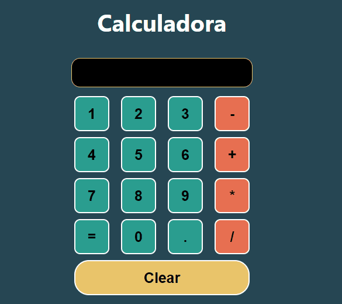

# Calculator 🖩

This is a calculator made with `React.JS` using some important Hooks 🪝 like `useState()` and `useEffect()`.   
 
Too I used some color palette taking ideas from a [Palete Generator](https://coolors.co/b9ffb7-abedc6-98d9c2-f19a3e-403233) making greats `CSS` styles.  
  

  
 
 
Have you a nice day 🔥   
 
### Made with love by [Luis Eduardo Sotoj](luissotoj.com) 💚